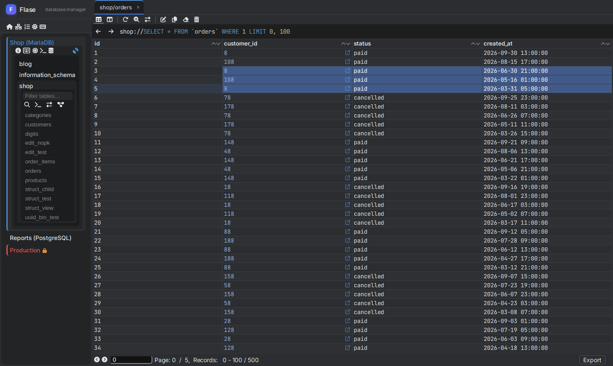
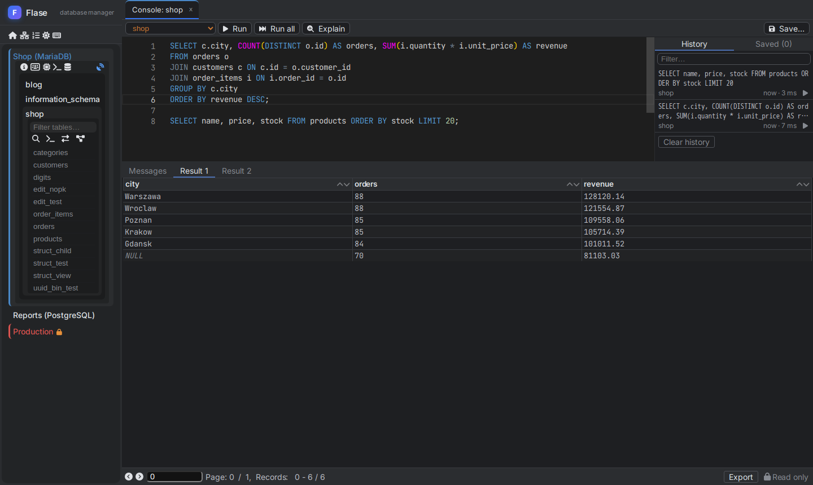
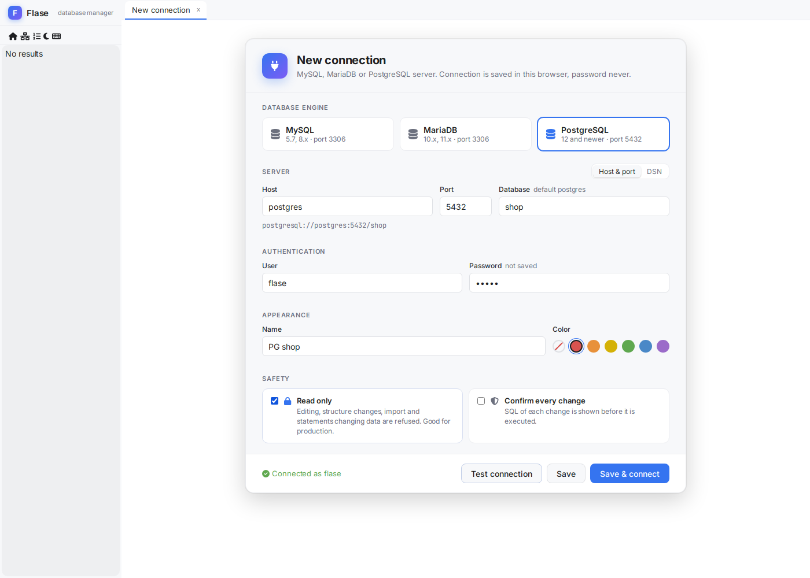

# Flase - modern web database manager, phpMyAdmin alternative

**Flase** is a fast, open source **web-based database client** for **MySQL**, **MariaDB** and **PostgreSQL**.
It is a modern **alternative to phpMyAdmin and Adminer** with the comfort of desktop tools like DataGrip, DBeaver or HeidiSQL -
but running in the browser, in one Docker container.

Browse and edit data in a spreadsheet-like grid, change table structure with SQL preview, run queries in an SQL console,
import and export dumps, draw ER diagrams and manage users - all from one self-hosted web application.



## Why Flase

- **Made for daily work** - virtualized data grid with thousands of cells, inline editing, multi selection, keyboard shortcuts.
- **Safe for production** - read only connections enforced by the server, colored connections, SQL preview of every change.
- **Works where your database is** - deploy one container next to the database; connections can be predefined
  by administrator, so the database is reachable only from the Flase server.
- **One tool for MySQL, MariaDB and PostgreSQL** - the same UI for all three engines.

## Features

### Data grid
- Fast virtualized grid (only visible rows and columns are rendered) - comfortable with 50+ columns
- Inline cell editing (double click) and **Edit cell** popup with big text area for long texts and JSON
- Multi selection (drag, Shift + click, Ctrl + click), delete of selected rows, add / clone / edit row in a form
- Pending changes with **SQL preview**, submit with Ctrl + S, optional confirmation of every change
- Copy selection or whole selected rows as **TSV, CSV, JSON, Markdown or SQL INSERT**
- Foreign key navigation (open referenced row in the same or a new tab)
- Quick filters from cell values, sorting, paging, query bar with history and SQL completion
- Resizable columns (drag the header edge, double click to fit content) remembered per table
- Value editor for JSON (format / minify), long texts and binary values (hex / text)
- UUID and binary (BINARY(16), bytea) primary keys, tables without primary key

### Structure
- Columns, indexes, foreign keys, triggers and DDL of tables and views
- Add, change and drop columns, indexes and foreign keys - **every DDL statement is previewed** before execution
- Rename, copy, truncate and drop tables

### SQL console
- Many statements in one run, results in tabs, messages with timing and affected rows
- Run statement under cursor (Ctrl + Enter) or everything (Ctrl + Shift + Enter)
- Query history and saved queries, EXPLAIN, cancel of running query (KILL QUERY / pg_cancel_backend)
- SQL completion of tables, columns and keywords (Monaco editor)



### Import / export
- Streamed **SQL dump** of databases and tables (also **gzip**), structure and / or data
- SQL and **CSV import** with progress, column mapping and preview, stop on error
- Export as text in the browser (like phpMyAdmin "view output as text") and import of pasted text

### More
- **ER diagram** of a database with movable layout and SVG export
- **Users and privileges** - accounts, roles and GRANTs of MySQL, MariaDB and PostgreSQL
- Processlist with kill of queries, search across all tables of a database
- **Dark and light theme**, keyboard shortcuts (F1 shows all of them)
- Several servers open at once in the sidebar, tabs colored by connection



## Quick start (Docker)

```bash
docker run -d --name flase -p 3001:3001 -e JWT_SECRET=$(openssl rand -hex 32) <dockerhub-user>/flase:latest
```

Open http://localhost:3001 and add a connection, for example `mysql://db-host:3306`, `mariadb://db-host:3306`
or `postgresql://db-host:5432/database`. Passwords are never stored - they are asked when connecting.

### docker compose

```yaml
services:
  flase:
    image: <dockerhub-user>/flase:latest
    ports:
      - "3001:3001"
    environment:
      JWT_SECRET: change-me-to-a-long-random-string
      # connections defined by administrator (optional)
      FLASE_CONNECTIONS: >-
        [{"name": "Shop production", "dsn": "mysql://10.0.0.5:3306", "username": "app", "readOnly": true, "color": "#d9534f"},
         "postgresql://10.0.0.6:5432/reports"]
      # users can use only connections above
      FLASE_ALLOW_CUSTOM_CONNECTIONS: "false"
```

## Configuration

| Variable | Default | Description |
|---|---|---|
| `PORT` | `3001` | Port of the server (application, API and websocket) |
| `JWT_SECRET` | random at start | Secret of session tokens. Set it when more instances run behind a load balancer |
| `JWT_TOKEN_EXPIRE` | `1h` | Lifetime of a session token (it is refreshed while the application is open) |
| `IDLE_CONNECTION_RELEASE_SECONDS` | `30` | Database connections of a closed browser are released after this time |
| `FLASE_CONNECTIONS` | - | JSON array of predefined connections: a DSN string or an object with `name`, `dsn`, `username`, `readOnly`, `color`, `confirmChanges` |
| `FLASE_ALLOW_CUSTOM_CONNECTIONS` | `true` | `false` = users can use only predefined connections |

Predefined connections are resolved by the server: the address is never taken from the browser and `readOnly`
is enforced for the whole session. Credentials written in a predefined DSN are never sent to the browser.

The browser of the user needs access to `cdn.jsdelivr.net` (SQL editor) and Google Fonts; the database is accessed only
by the server.

## Development

```bash
docker compose up          # front on :3000 (also :8070), server on :3001, test MySQL / MariaDB / PostgreSQL
tests/run.sh               # all tests (server + browser), tests/run.sh ui console = only tests with "console"
tests/run.sh image         # build the production image and run browser smoke test against it
```

- `front/` - React 18 + TypeScript (Create React App), Monaco editor
- `server/` - Node.js + Express + WebSocket (express-ws) + TypeScript, drivers `mysql` and `pg`
- `docker/production/Dockerfile` - production image, published to Docker Hub by GitHub Actions on a `v*` tag

Changes of each version are in [CHANGELOG.md](CHANGELOG.md).

---

*Keywords: phpMyAdmin alternative, Adminer alternative, web database client, MySQL GUI, MariaDB GUI, PostgreSQL GUI,
pgAdmin alternative, database manager, database administration tool, SQL editor, SQL client, self-hosted, Docker, open source.*
